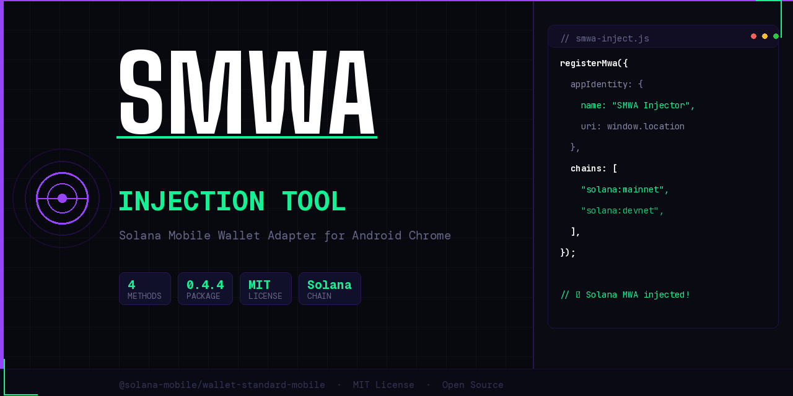
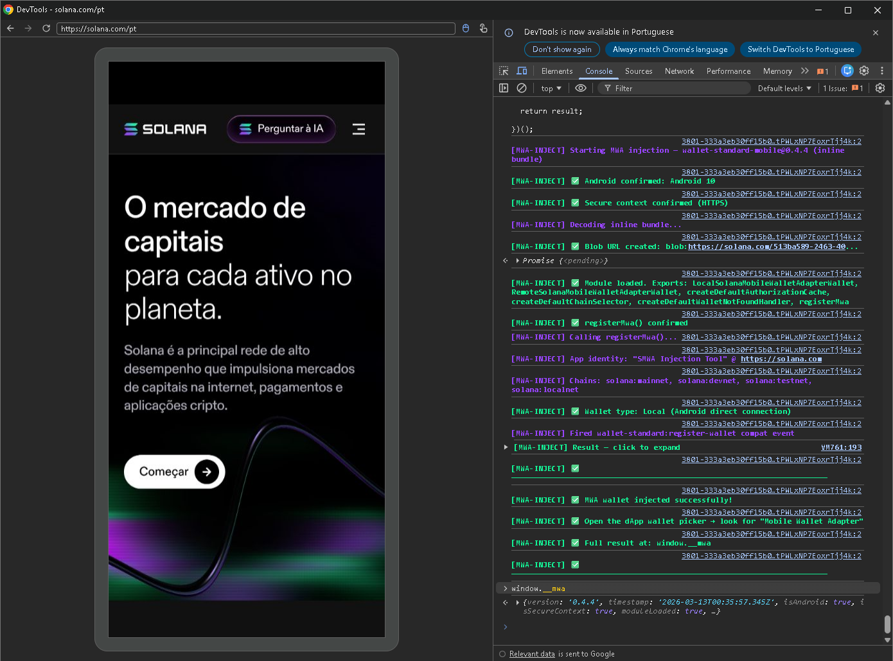
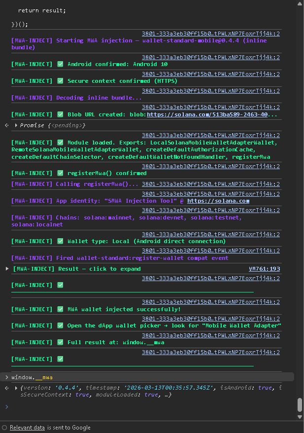
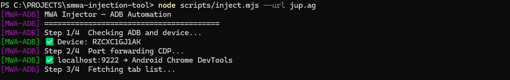
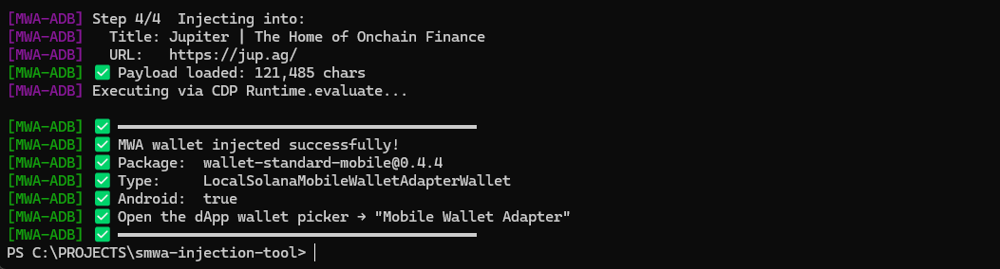
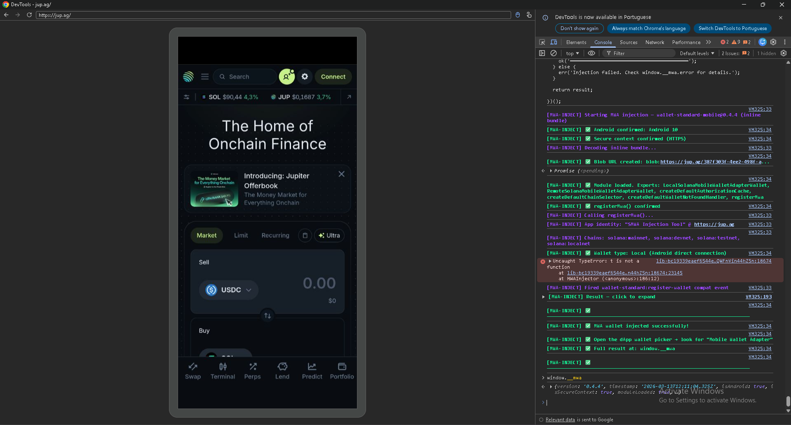
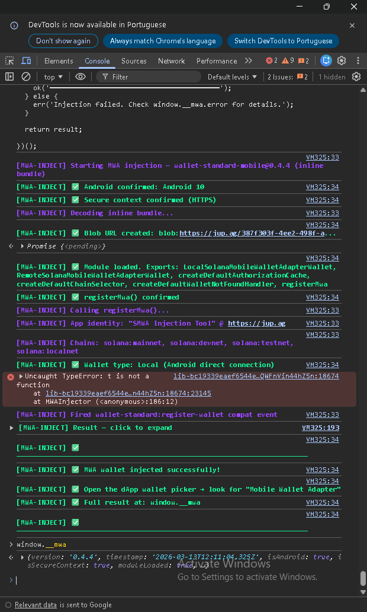
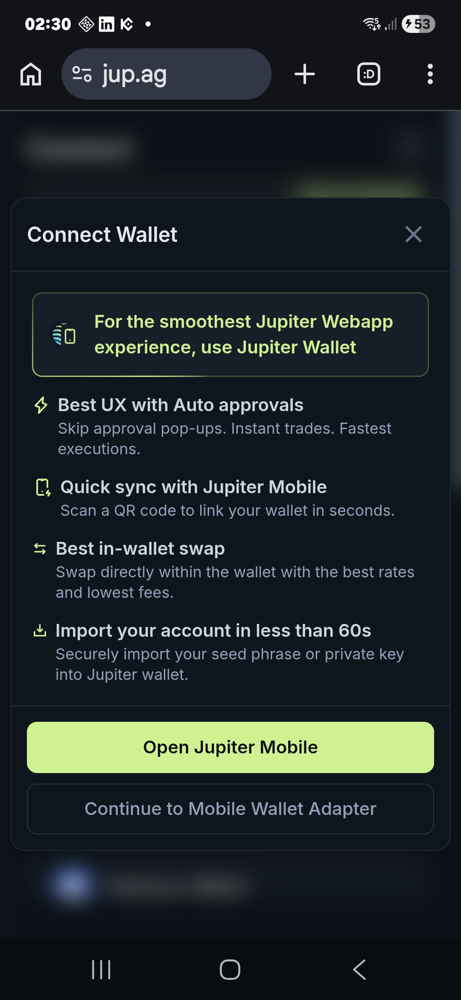
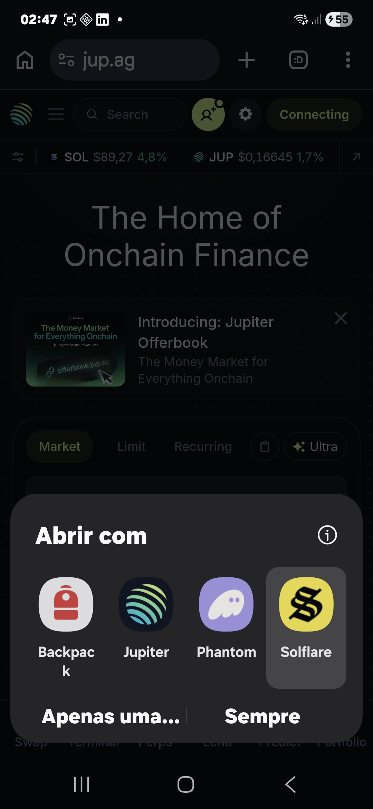

```
 _____ ___  ___ _    _   ___    _____  _   _     ___  _____  _____  _____  _____ ______
/  ___||  \/  || |  | | / _ \  |_   _|| \ | |   |_  ||  ___|/  __ \|_   _||  _  || ___ \
\ `--. | .  . || |  | |/ /_\ \   | |  |  \| |     | || |__  | /  \/  | |  | | | || |_/ /
 `--. \| |\/| || |/\| ||  _  |   | |  | . ` |     | ||  __| | |      | |  | | | ||    /
/\__/ /| |  | |\ \/ / | | | |  _| |_ | |\  |/\__/ /| |___  | \__/\  | |  \ \_/ /| |\ \
\____/ \_|  |_/ \_/   \_| |_/  \___/ \_| \_/\____/ \____/   \____/  \_/   \___/ \_| \_|
```

<div align="center">

**Solana Mobile Wallet Adapter — On-the-fly injection for Android Chrome**

[](LICENSE)
[](https://www.npmjs.com/package/@solana-mobile/wallet-standard-mobile)
[](https://chromestatus.com/feature/5632956022923264)
[](https://solana.com)



*Inject `@solana-mobile/wallet-standard-mobile` into any Android Chrome page — no website modifications required.*

</div>

---

## What Is This?

When QA engineers and developers test Mobile Wallet Adapter (MWA) compatibility, they face a core problem: **standard websites browsed via Android Chrome do not automatically inject the MWA wallet interface.** You either have to modify the target website, or use a special wallet browser — both options create friction and slow down testing.

**SMWA Injection Tool solves this.** It injects the Solana MWA Standard Wallet interface into any page on the fly, making "Mobile Wallet Adapter" immediately appear in any Solana dApp's wallet picker — without touching a single line of the dApp's code.

> **S** = Solana · **MWA** = Mobile Wallet Adapter · Built for the Solana Mobile ecosystem

---

## 4 Methods. Every Use Case Covered.

| Method | Requires | Setup | Auto on every page | Best for |
|--------|----------|-------|--------------------|----------|
| **A — Chrome Extension** | Android Chrome 128+ | Install once | ✅ Yes | Daily QA testing |
| **B — DevTools Payload** | USB + desktop Chrome | None | Manual paste | Developer debugging |
| **C — Bookmarklet** | Android Chrome | Save one bookmark | One tap | No desktop available |
| **D — ADB Script** | USB + Node.js | `npm install` | One command | CI/CD pipelines |

---

## Proof of Concept

Tested live on **https://solana.com** — Android 10, Chrome 145, USB remote debugging:

```
[MWA-INJECT] Starting MWA injection — wallet-standard-mobile@0.4.4 (inline bundle)
[MWA-INJECT] ✅ Android confirmed: Android 10
[MWA-INJECT] ✅ Secure context confirmed (HTTPS)
[MWA-INJECT] Decoding inline bundle...
[MWA-INJECT] ✅ Blob URL created: blob:https://solana.com/c980be49-9c16-45...
[MWA-INJECT] ✅ Module loaded. Exports: LocalSolanaMobileWalletAdapterWallet,
             RemoteSolanaMobileWalletAdapterWallet, createDefaultAuthorizationCache,
             createDefaultChainSelector, createDefaultWalletNotFoundHandler, registerMwa
[MWA-INJECT] ✅ registerMwa() confirmed
[MWA-INJECT] ✅ Wallet type: Local (Android direct connection)
[MWA-INJECT] ✅ MWA wallet injected successfully!
```

```javascript
> window.__mwa
{
  version: '0.4.4',
  timestamp: '2026-03-12T21:38:56.736Z',
  isAndroid: true,
  isSecureContext: true,
  moduleLoaded: true,
  registered: true,
  walletType: 'LocalSolanaMobileWalletAdapterWallet',
  error: null
}
```

### Live Test — solana.com (Android 10, Chrome 145)




---

### Live Test — jup.ag · Jupiter DEX (Android 10, Chrome 145)

Real Solana dApp. Real wallet picker. Real MWA connection. No code modified.

**ADB Script — device detected and injection confirmed:**




**DevTools console — full green injection log on jup.ag:**




**Phone — wallet picker responding to MWA after injection:**




After injection, jup.ag shows **"Continue to Mobile Wallet Adapter"** — that button only appears because the injection told Jupiter that MWA exists on this page. Tapping it opens the Android system wallet selector with Backpack, Phantom, Solflare and Jupiter all responding to the MWA connection request. Without this tool, none of that happens on a standard Android Chrome browser.

---

## ✅ Tested dApps

Confirmed working on **Samsung A55, Android 10, Chrome 145** via Method B (DevTools):

| dApp | URL | Result | Notes |
|------|-----|--------|-------|
| Jupiter | jup.ag | ✅ Pass | Full MWA flow |
| Orca | orca.so | ✅ Pass | Phantom, Backpack, Solflare, MWA appear |
| Raydium | raydium.io | ✅ Pass | MWA appears (shown twice — Raydium quirk) |
| Magic Eden | magiceden.io | ✅ Pass | MWA marked as "Installed" |
| Drift | drift.trade | ✅ Pass | MWA marked as "Detected" — cleanest result |


> Full test results, device compatibility table, and all screenshots: [TESTED-DAPPS.md](TESTED-DAPPS.md)
---

## How to Test Your Own dApp

Use this tool to verify MWA works correctly in your Solana dApp — without modifying a single line of your code.

**Method B (DevTools) — step by step:**

1. Connect your Android phone to your PC via USB
2. Enable USB debugging on your phone: **Settings → Developer Options → USB Debugging**
3. Open **Chrome** on your phone and navigate to your dApp (must be HTTPS)
4. On your PC, open Chrome and go to `chrome://inspect/#devices`
5. Find your dApp tab under your device and click **inspect**
6. In the **Console** tab that opens, open `payload/mwa-inject.js` from this repo and paste the entire contents
7. Hit **Enter**

**Your console should show every line green:**
```
[MWA-INJECT] ✅ Android confirmed: Android 10
[MWA-INJECT] ✅ Secure context confirmed (HTTPS)
[MWA-INJECT] ✅ Module loaded
[MWA-INJECT] ✅ registerMwa() confirmed
[MWA-INJECT] ✅ App identity: "SMWA Injection Tool" @ https://your-dapp.com
[MWA-INJECT] ✅ Chains: solana:mainnet, solana:devnet, solana:testnet, solana:localnet
[MWA-INJECT] ✅ Wallet type: Local (Android direct connection)
[MWA-INJECT] ✅ MWA wallet injected successfully!
```

8. On your phone, tap **Connect Wallet** in your dApp
9. You should see **"Mobile Wallet Adapter"** in the wallet list
10. Tap it — your installed wallets (Phantom, Backpack, Solflare) will respond

**Method D (ADB Script) — one command:**
```bash
node scripts/inject.mjs --url your-dapp.com
```

> ⚠️ If your dApp scans for wallets on page load, inject immediately after the page loads or use **Method A (Chrome Extension)** which injects at `document_start` — before any page JavaScript runs.
---

## Quick Start

**Method A — Chrome Extension** *(install once, auto-injects forever)*
```bash
git clone https://github.com/YOUR_GITHUB_USER/smwa-injection-tool
cd smwa-injection-tool && npm install && node build.mjs
# Transfer extension/ folder to Android
# chrome://extensions → Developer mode → Load unpacked → select extension/
```

**Method B — DevTools Console** *(fastest, zero setup)*
```bash
# Connect Android via USB
# Desktop Chrome → chrome://inspect/#devices → inspect tab → Console
# Paste payload/mwa-inject.js → Enter → done
```

**Method C — Bookmarklet** *(no USB, no desktop needed)*
```bash
node payload/bookmarklet.js   # prints the javascript: URI to save as bookmark
# On any dApp: address bar → type "Inject" → tap "SMWA Inject"
```

**Method D — ADB Script** *(CI/CD automation)*
```bash
npm run inject:list            # list open Chrome tabs on device
npm run inject                 # inject into first HTTPS tab
node scripts/inject.mjs --url jup.ag   # target specific dApp
```

---

## Repository Structure

```
smwa-injection-tool/
│
├── payload/
│   ├── mwa-inject.js                  ← DevTools payload (84KB bundle embedded inline)
│   ├── bookmarklet.js                 ← Android Chrome bookmarklet
│   └── mwa-wallet-standard.bundle.js  ← ESM bundle (esbuild, wallet-standard-mobile@0.4.4)
│
├── extension/
│   ├── manifest.json                  ← Chrome MV3 manifest (Chrome 128+)
│   ├── mwa-wallet-standard.bundle.js  ← Bundle as web_accessible_resource
│   ├── src/
│   │   ├── content.js                 ← Isolated world bridge → injects into MAIN world
│   │   ├── inject.js                  ← MAIN world MWA registrar
│   │   └── background.js              ← Service worker, badge state
│   └── popup/
│       ├── popup.html                 ← Toggle UI (global + per-site)
│       └── popup.js
│
├── scripts/
│   ├── inject.mjs                     ← ADB + Chrome DevTools Protocol automation
│   ├── inject.sh                      ← Shell wrapper (Linux/macOS)
│   └── package-extension.mjs         ← Packages extension as distributable .zip
│
├── docs/
│   ├── smwa-banner.png                ← Project banner
│   ├── CHROME-EXTENSION.md
│   ├── DEVTOOLS-PAYLOAD.md
│   └── ADB-AUTOMATION.md
│
├── build.mjs                          ← esbuild bundler
├── TESTING.md                         ← Verification guide for all 4 methods
├── CONTRIBUTING.md
└── LICENSE                            ← MIT
```

---

## Method A — Chrome Extension (MV3)

The primary solution. Installs once on Android Chrome 128+ and **automatically injects MWA on every HTTPS page load** — no USB, no pasting, no action required.

### Architecture

```
Page starts loading (document_start)
  └─► content.js  [ISOLATED world — can't touch page JS directly]
        └─► injects <script src="inject.js"> tag into DOM
              └─► inject.js  [MAIN world — page's own JS context]
                    └─► import(chrome-extension://…/mwa-wallet-standard.bundle.js)
                          └─► registerMwa() → wallet visible to dApp's Wallet Standard
```

The bridge pattern (isolated world → MAIN world via `<script>` tag pointing to a `web_accessible_resource`) is the same approach used by MetaMask and Phantom. The `chrome-extension://` URL bypasses all page CSP restrictions entirely.

### Popup UI
Tap the ◎ icon to toggle injection globally or disable it per-site.

---

## Method B — DevTools Console Payload

Paste `payload/mwa-inject.js` into Chrome DevTools console via USB remote debugging. Works on any HTTPS page instantly.

### Why Inline Bundle?

Previous approaches all failed:

| Approach | Failure reason |
|----------|---------------|
| `esm.sh` CDN | `startScenario` export missing — dep mismatch in `0.5.x` betas |
| Local HTTP server | Mixed content blocked (HTTP script on HTTPS page) |
| ngrok HTTPS tunnel | Setup friction + connection timeouts |

**The solution:** embed the entire 84KB bundle as base64 directly in the script file. At runtime, decode it into a `Blob` and import from a `blob://` URL:

```
BUNDLE_B64 (113KB base64 string, embedded in mwa-inject.js)
  └─► atob() → Uint8Array → Blob → URL.createObjectURL()
        └─► import(blob://) → registerMwa()
```

**No server. No ngrok. No network request. No CSP issues. Works on any HTTPS page.**

---

## Method C — Bookmarklet

A `javascript:` URI saved as a Chrome bookmark. Tap it from any dApp — MWA injects in under a second. No USB, no desktop, no installation.

```bash
# Generate the URI after publishing to GitHub with v1.0.0 tag
node payload/bookmarklet.js
```

Loads the bundle from `cdn.jsdelivr.net`. If the target dApp's CSP blocks this domain, use the Chrome Extension instead — it loads from a `chrome-extension://` URL which is always CSP-exempt.

---

## Method D — ADB Automation Script

Automates injection via ADB + Chrome DevTools Protocol. Handles port forwarding automatically. Designed for CI/CD integration.

```bash
npm run inject                               # inject into first HTTPS tab
npm run inject:list                          # list all open Chrome tabs
node scripts/inject.mjs --tab 2             # inject into tab by index
node scripts/inject.mjs --url solana.com    # inject into matching tab
node scripts/inject.mjs --verbose           # show full CDP traffic
```

---

## Troubleshooting

**Wallet picker doesn't show "Mobile Wallet Adapter" after injection**
The dApp scanned for wallets before injection. Reload and inject immediately, or use the Chrome Extension (injects at `document_start`).

**Wallet shows but tapping gives "No wallet found"**
Install a MWA-compatible wallet: [Phantom](https://play.google.com/store/apps/details?id=app.phantom) · [Solflare](https://play.google.com/store/apps/details?id=com.solflare.mobile) · [Backpack](https://play.google.com/store/apps/details?id=app.backpack)

**`chrome://extensions` not loading on Android**
Requires Chrome 128+. Check `chrome://version`. Some Samsung devices have the extensions flag unavailable at manufacturer level — use DevTools or Bookmarklet method instead.

**ADB: "No Android device detected"**
```bash
adb kill-server && adb start-server && adb devices
```
Check the "Allow USB debugging?" dialog on your Android screen.

**Device or tab disappears from `chrome://inspect/#devices`**
Unplug and replug the USB cable, unlock your phone and tap "Allow USB Debugging" if prompted,
close and reopen Chrome on the phone, navigate to the dApp again, then refresh `chrome://inspect/#devices`.

**`TypeError: i/t is not a function` in dApp console after injection**
This is an internal dApp error, not caused by SMWA. Injection completes successfully regardless —
look for `[MWA-INJECT] ✅ MWA wallet injected successfully!` to confirm. Close the DevTools window
before opening a new session for a different dApp to avoid conflicts.

See [TESTING.md](TESTING.md) for the full verification guide.

---

## Why `@0.4.4` and Not `0.5.0-beta2`?

`0.5.0-beta2` imports `startScenario` from `@solana-mobile/mobile-wallet-adapter-protocol` — but that export does not exist in `^2.2.5`. Only `startRemoteScenario` does. Fatal import error.

`0.4.4` correctly uses `startRemoteScenario`, is the latest stable release, and exposes the same `registerMwa()` API surface.

---

## Contributing

See [CONTRIBUTING.md](CONTRIBUTING.md). PRs welcome — especially for testing on different Android devices and Chrome versions.

---

## License

MIT — see [LICENSE](LICENSE)

---

<div align="center">

Built for the **Solana Mobile MWA RFP** · MIT License · Open Source

*Explored and implemented all 4 injection approaches outlined in the RFP:*
*Chrome Extension · DevTools Payload · Bookmarklet · ADB Automation*

</div>
