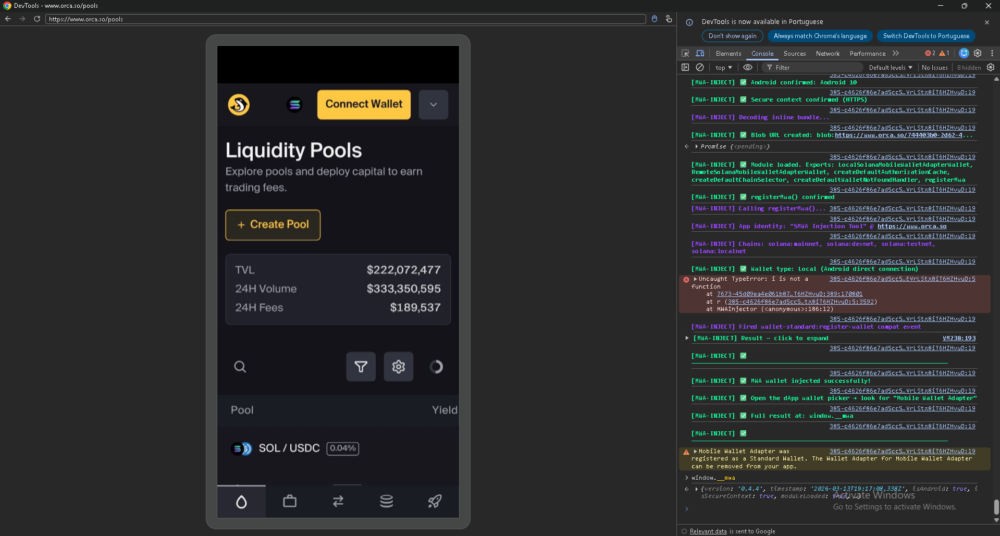
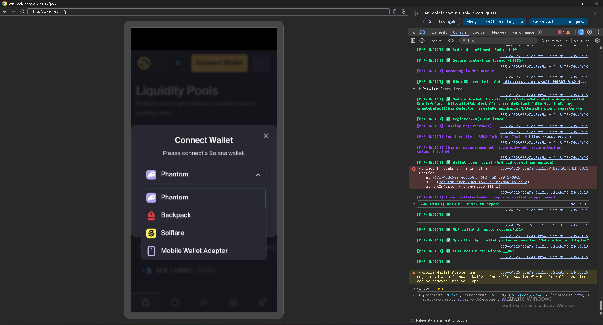
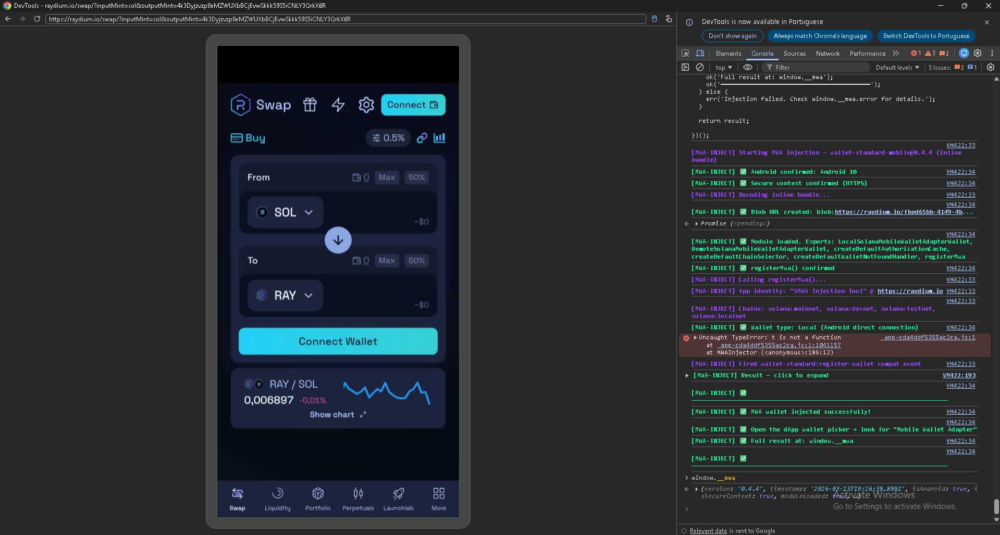
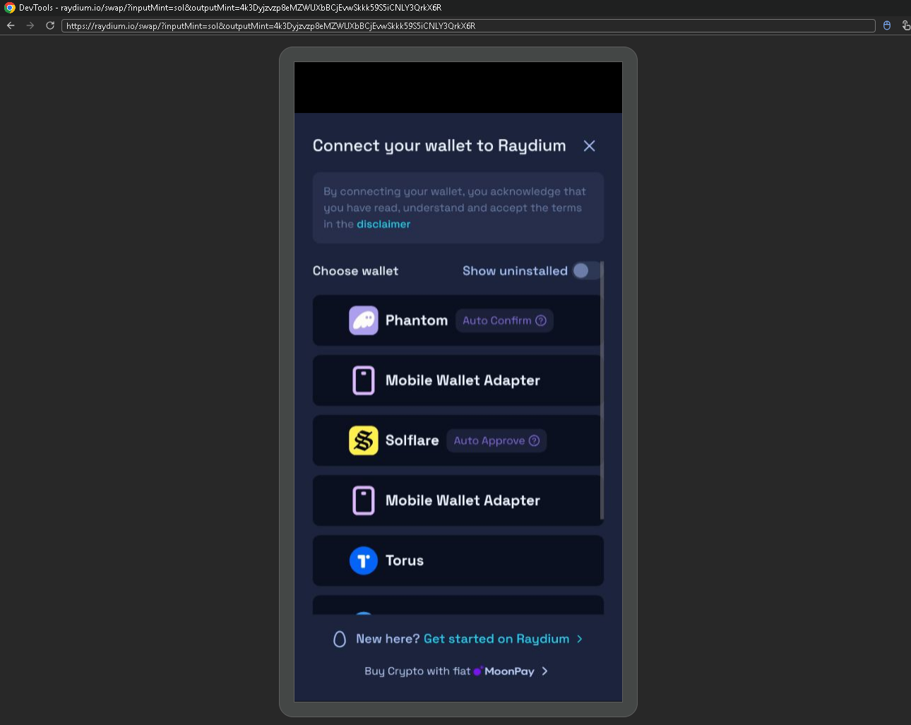
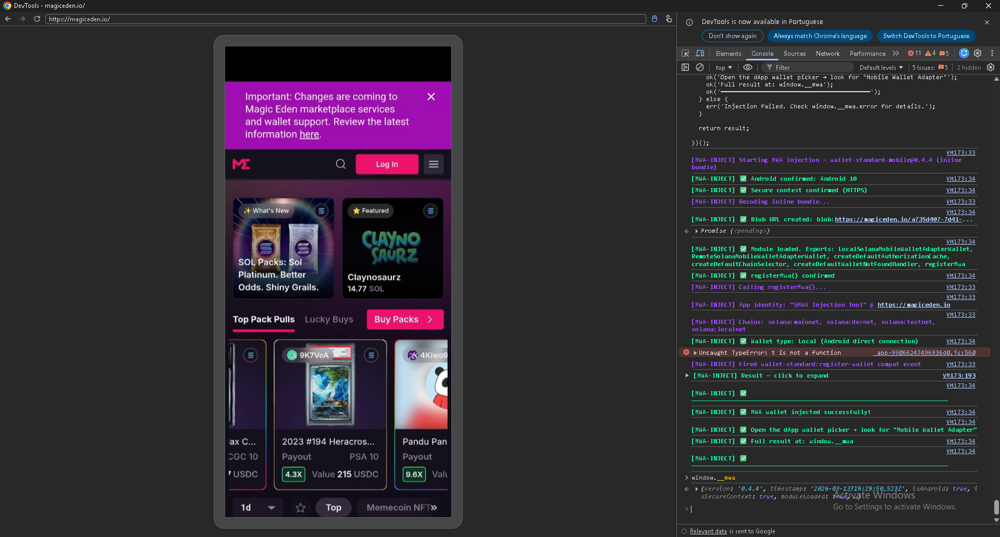
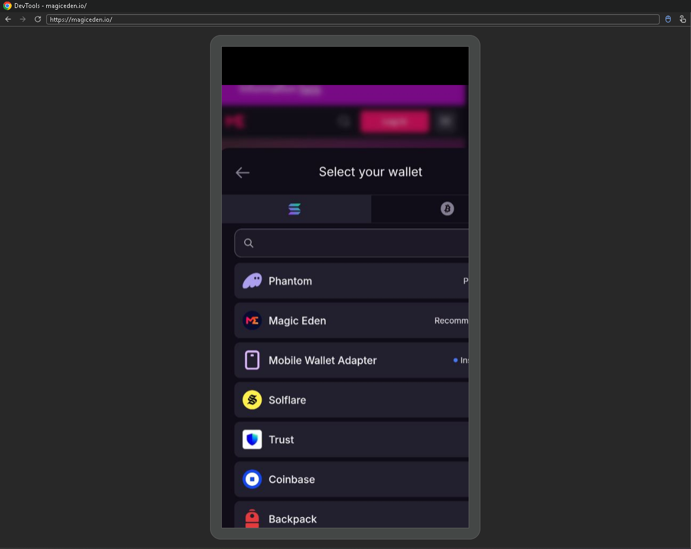
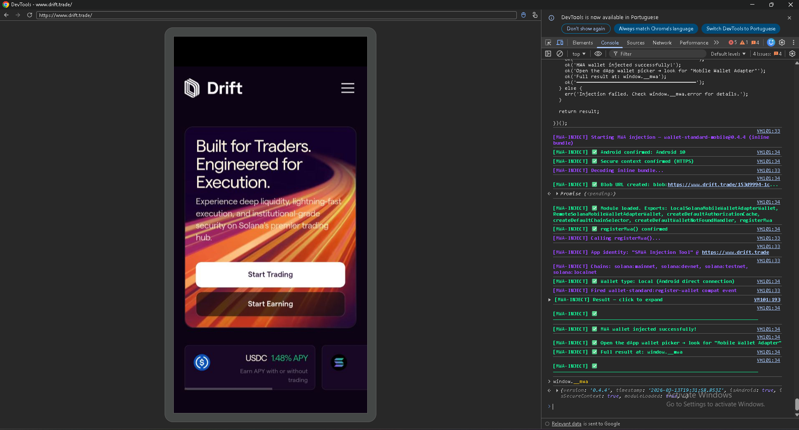
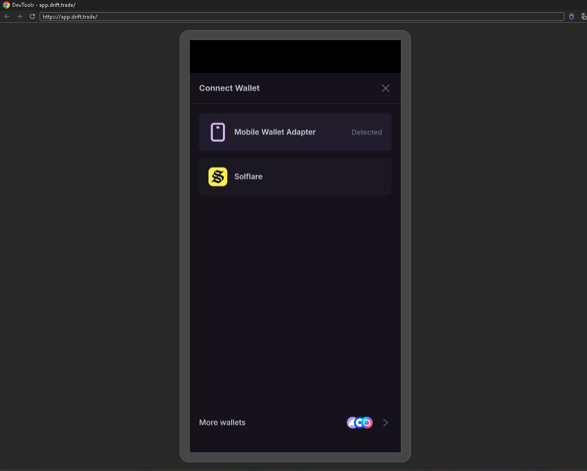

# SMWA Injection Tool — Tested dApps & Device Compatibility

> Last updated: March 13, 2026

---

## ✅ Confirmed Working

| dApp | URL | Method | Device | Notes |
|------|-----|--------|--------|-------|
| Jupiter | jup.ag | Method B (CDP) | Samsung A55, Android 10, Chrome 145 | Wallet picker appears, full MWA flow works |
| Orca | orca.so/pools | Method B (CDP) | Samsung A55, Android 10, Chrome 145 | Wallet picker appears — Phantom, Backpack, Solflare, Mobile Wallet Adapter |
| Raydium | raydium.io | Method B (CDP) | Samsung A55, Android 10, Chrome 145 | Wallet picker appears — Mobile Wallet Adapter shown twice (Raydium quirk, not SMWA bug) |
| Magic Eden | magiceden.io | Method B (CDP) | Samsung A55, Android 10, Chrome 145 | Wallet picker appears — Mobile Wallet Adapter marked as "Installed" |
| Drift | drift.trade | Method B (CDP) | Samsung A55, Android 10, Chrome 145 | Wallet picker appears — Mobile Wallet Adapter marked as "Detected" — cleanest result |

---

## 📸 Screenshots

### Orca

### Raydium

### Magic Eden

### Drift

---

## 🔲 Pending Tests

| dApp | URL | Status |
|------|-----|--------|
| MarginFi | marginfi.com | Not yet tested |

---

## 📱 Device Compatibility — Method A (Chrome Extension)

| Device | Android Version | Chrome Version | Method A Status | Notes |
|--------|----------------|----------------|-----------------|-------|
| Samsung A55 | Android 10 | Chrome 145 | ❌ Blocked | Samsung blocks Chrome extensions at manufacturer level, even in developer mode. Method A is non-functional on Samsung hardware. |

> **Note for users:** If you are on a Samsung device, use **Method B (Chrome DevTools Protocol)** instead. Method A requires a non-Samsung Android device where the manufacturer does not restrict Chrome extension loading.

---

## 🔵 Method B (Chrome DevTools Protocol) — Device Compatibility

| Device | Android Version | Chrome Version | Status | Notes |
|--------|----------------|----------------|--------|-------|
| Samsung A55 | Android 10 | Chrome 145 | ✅ Working | Confirmed on Jupiter, Orca, Raydium, Magic Eden, Drift |

---

## 🔧 Troubleshooting — Device Not Showing in chrome://inspect/#devices

If your Android device or dApp tab disappears from `chrome://inspect/#devices`, follow these steps:

1. **Unplug** the USB cable from your PC
2. **Replug** the USB cable
3. **Unlock your phone** — tap "Allow USB Debugging" if prompted
4. **Close and reopen Chrome** on your phone
5. **Navigate to the dApp** again on your phone
6. **Refresh** `chrome://inspect/#devices` on your PC
7. Your device and tab should now appear

> **Note:** Only have **one DevTools session open at a time**. Having multiple DevTools windows open simultaneously can cause injection conflicts and `TypeError` errors in the dApp console. Always close the previous DevTools window before opening a new one for the next dApp.

---

## 📝 Notes

- The `TypeError: i/t is not a function` seen in some dApp consoles (Orca, Raydium, Magic Eden) is an **internal dApp error**, not caused by SMWA. Injection completes successfully regardless.
- Drift showed the cleanest result — Mobile Wallet Adapter explicitly marked as **"Detected"**
- Magic Eden marked Mobile Wallet Adapter as **"Installed"**
- Raydium shows Mobile Wallet Adapter **twice** — Raydium-specific quirk, not a bug in SMWA
- All tests use `wallet-standard-mobile@0.4.4`
- Testing is ongoing — PRs welcome with your own device/dApp results
- If you test Method A on a non-Samsung Android device, please open an issue or PR with your findings
